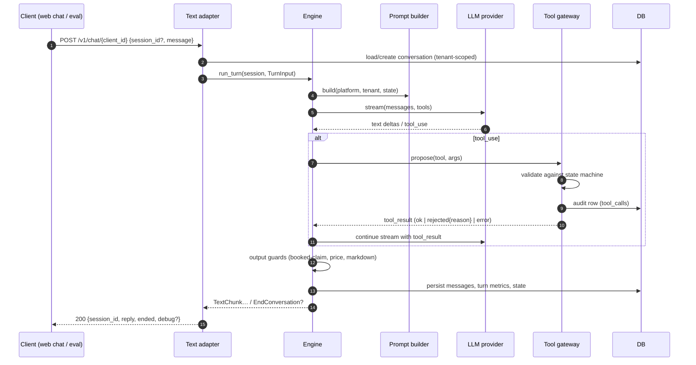
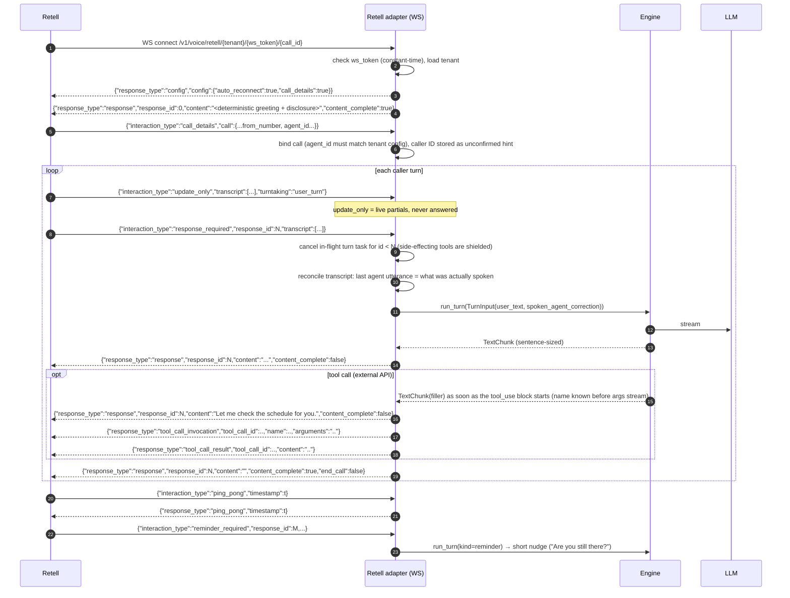
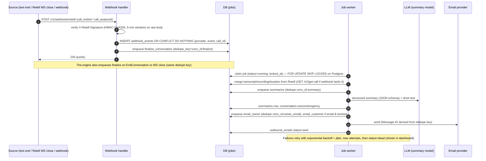
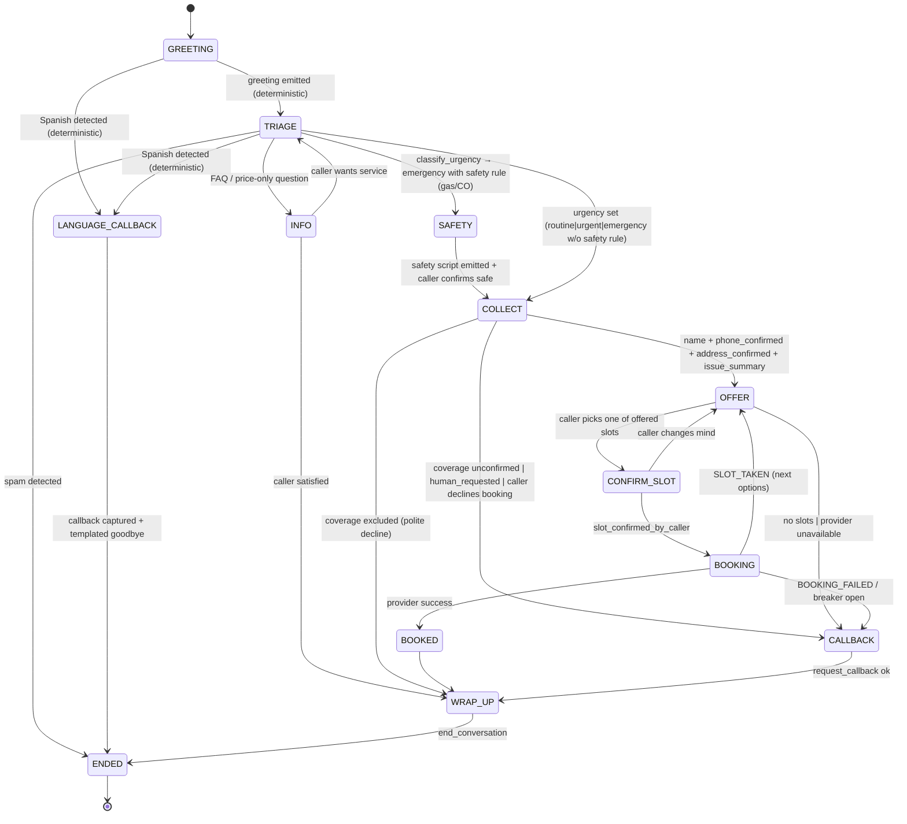

# AI Receptionist for Home Services: Design (Phase 0)

Status: **Approved with changes** (rev 3, 2026-10-01). First tenant: Jolly Brothers Services (Round Rock, TX, HVAC).

This is a **spec demo built for Jolly Brothers**. It is not their production system. Every booking goes to the demo owner's own Cal.com account and event type, and every email goes to demo inboxes.

### Revision 3 changelog (Phase 2 review)
1. **Two-tier service-area coverage** (section 3.7). Explicitly listed areas get the normal booking flow. Anything not listed and not in `excluded_areas` gets a soft path: capture details, tell the caller the team will confirm coverage, outcome `callback` with reason `coverage_unconfirmed`. Only `excluded_areas` get a polite decline. The Round Rock ZIPs and the nearby cities (Georgetown, Hutto, Pflugerville, Cedar Park, Leander, Austin) are **unverified candidates** in the soft tier.
2. **Season-aware urgency rules** (section 3.8). Vulnerable person + no cooling → emergency during the tenant's `hot_season` (Jolly Brothers: May 1–Oct 31), urgent otherwise. No cooling without a vulnerable person → urgent in hot season, routine otherwise. The caller never has to say "heat".
3. **Placeholder email** comes from a template (`PLACEHOLDER_EMAIL_TEMPLATE=myname+jb-{session_short}@gmail.com`) instead of a catch-all domain. The Phase 3 smoke script confirms Cal.com accepts plus-addressed emails.
4. **The revenue card** is labelled as an estimate and shows the average-job-value assumption (section 15).
5. **Secret scanning**: a pre-commit hook and a CI job reject key-shaped strings (`sk-ant-`, `cal_`, `key_`) and committed `.env` files (section 9).

### Revision 2 changelog (owner review)
1. Bookings go to the **demo owner's Cal.com account and event type**, not Jolly Brothers'. See A1, A8 and section 6.
2. A **demo clock override** (`DEMO_NOW`), tenant-timezone aware. It is used everywhere "now" matters and cannot be enabled outside demo mode. See section 5.5.
3. A **templated filler line** is streamed before any tool that calls an external API. Time-to-first-audible is measured separately from time-to-final-answer. See sections 7.4 and 8.
4. The Cal.com **attendee email** behavior is verified in the Phase 3 smoke script, with a configurable placeholder address (rev 3: a plus-address template, not a catch-all domain). See section 11.2.
5. **Full Spanish is deferred to milestone 2.** Milestone 1 detects Spanish, plays a templated Spanish callback message, captures a callback, and logs `language=es`. The i18n seams stay in place. See section 3.6.
6. **Phase order** is now 1 → 2 (with a minimal 10-persona eval) → 3 → 5 → 6 → 4 → 7. See section 16.
7. **Models:** summaries use `claude-sonnet-5-5`. The judge stays on `claude-opus-5-5` with a `--judge-model` flag, and eval run cost is logged.

---

## 1. Context, goals, non-goals, assumptions

### 1.1 Context
Small HVAC and home-services companies lose jobs when nobody answers after hours or when the office line is busy. We are building a multi-tenant AI receptionist. A caller phones in (or uses a browser web call), describes the problem, gets triaged, picks a real time slot, and ends up with a real booking. The owner gets an email summary, and every call shows up in a dashboard with its transcript and recording.

The first milestone is a recorded sales demo for **Jolly Brothers Services**, a family-owned HVAC company in Round Rock, TX (`America/Chicago`). They are closed weekends and after 5 PM.

### 1.2 Goals (milestone 1)
1. One channel-agnostic conversation engine, reached through a **text channel** (REST + web chat) and a **voice channel** (Retell custom-LLM websocket).
2. Correct triage (emergency / urgent / routine) driven by tenant rules, with a safety-first gas-leak script.
3. Collect and confirm caller details (name, E.164 phone that is read back, address that is read back, issue, optional email). Spanish callers are detected and routed to a templated callback (section 3.6).
4. **Real** availability and **real** Cal.com bookings, with idempotency, a slot re-check just before booking, race handling, and honest fallback.
5. A post-call pipeline that stores the transcript, recording, summary and outcome, emails the owner, and sends a customer confirmation.
6. A clean, server-rendered owner dashboard.
7. An eval harness with about 25 personas that gates prompt and engine changes.
8. Observability: per-turn latency, tokens, cost and a tool audit log.

### 1.3 Non-goals (milestone 1)
- Real call transfer. In demo mode it is simulated and logged.
- SMS alerts. On-call alerts go out by email and the log. SMS is a later adapter behind the same interface.
- Owner self-service config editing. Config lives in version-controlled JSON.
- Payment, invoicing, CRM sync, or rescheduling by voice. The cancel tool exists, but reschedule is out of scope.
- Microservices, external queues, Kubernetes, SPAs.
- Outbound calling.
- A full Spanish conversation (milestone 2). Milestone 1 ships only the detect-and-callback path, built on the same i18n seams.
- Any connection to Jolly Brothers' real calendar, inbox or phone system.

### 1.4 Assumptions (please correct any that are wrong)
| # | Assumption |
|---|---|
| A1 | Cal.com **hosted** (cal.com cloud), using the **demo owner's own account** and an API key (`cal_...`) from that account. The event type (e.g. "AC Service Visit (Jolly Brothers demo)") lives in that account, has a fixed 120-minute length, and its location is set to *attendee address* if possible. The API key and event type ID come from env (`CALCOM_DEMO_API_KEY`, `CALCOM_DEMO_EVENT_TYPE_ID`) and are referenced by name in the tenant config. *(Confirmed, rev 2.)* |
| A2 | The demo runs on a laptop and is exposed through a tunnel (cloudflared, with ngrok as an alternative). SQLite is used locally. *(Confirmed.)* |
| A3 | Email goes over **SMTP** (for example Gmail or Workspace with an app password) behind an interface, plus a console/file fake. The "owner" recipient is a demo inbox from env (`DEMO_OWNER_EMAIL`), not Joe's or Billy's real address. *(Confirmed.)* |
| A4 | Milestone 1 handles Spanish by **detecting it and routing to a templated Spanish callback**. Full Spanish is milestone 2. Owner summaries are always in English. *(Rev 2.)* |
| A5 | Live turns use `claude-haiku-4-5` with no extended thinking. Summaries use `claude-sonnet-5-5`. The eval judge uses `claude-opus-5-5`, overridable with `--judge-model`. The simulated caller uses `claude-sonnet-5-5`. All are configurable. *(Rev 2.)* |
| A6 | For the demo, a Retell **web call** from our dashboard is enough. A purchased Retell phone number is optional and uses the same code path. |
| A7 | The on-call contact is a **dummy** contact: a fictional 555-01xx number plus a demo inbox. "Alert on-call" sends an email to that inbox and logs a simulated SMS. |
| A8 | Every demo booking lands on the **demo owner's** Cal.com calendar. Nothing touches Jolly Brothers' systems. *(Confirmed, rev 2.)* |
| A9 | Retell manages recordings. We store Retell's `recording_url` and do not re-host audio in milestone 1. |
| A10 | The Jolly Brothers config you pasted is the source. It has been mapped into the validated schema (section 6.2). Remaining `TODO`s, such as surrounding cities, are tracked in the config's `todos` list and show up as startup warnings. |
| A11 | Demo recordings use `DEMO_NOW` (for example "Saturday 2:10 PM Central") so after-hours and weekend behavior can be shown at any real time of day. *(Rev 2.)* |

---

## 2. Architecture

### 2.1 Overview
One deployable FastAPI service and one relational database. Background work runs in an in-process async worker that polls a durable `jobs` table. Every external dependency (LLM, booking, email, voice platform) sits behind a Python `Protocol`, with a real adapter and a fake adapter.

```mermaid
flowchart LR
  subgraph Callers
    Phone[Phone / Retell web call]
    Web[Web chat page]
    Eval[Eval harness CLI]
  end

  subgraph Retell[Retell AI]
    ASR[ASR + turn-taking + TTS]
  end

  subgraph App["receptionist (single FastAPI service)"]
    direction TB
    RA[Retell channel adapter<br/>WS /v1/voice/retell/...]
    TA[Text channel adapter<br/>POST /v1/chat/{client_id}]
    WH[Webhook handler<br/>POST /v1/webhooks/retell]
    ENG[Conversation Engine<br/>state machine + LLM loop + guards]
    TOOLS[Tool gateway<br/>validate → execute → audit]
    PROMPT[Prompt builder<br/>platform / tenant / state layers]
    CFG[Tenant config registry<br/>validated JSON]
    REPO[Tenant-scoped repositories]
    JOBS[Job worker<br/>durable job table]
    DASH[Dashboard<br/>Jinja2 + HTMX, basic auth]
  end

  DB[(SQLite → Postgres)]
  LLM[Anthropic Messages API]
  CAL[Cal.com API v2]
  SMTP[SMTP server]

  Phone --> ASR
  ASR <-->|custom LLM websocket| RA
  Retell -->|signed webhooks| WH
  Web --> TA
  Eval --> TA
  RA --> ENG
  TA --> ENG
  ENG --> PROMPT --> CFG
  ENG --> TOOLS
  ENG --> LLM
  TOOLS --> CAL
  TOOLS --> REPO
  ENG --> REPO
  WH --> REPO
  WH --> JOBS
  ENG -->|on end| JOBS
  JOBS --> LLM
  JOBS --> SMTP
  JOBS --> REPO
  DASH --> REPO
  REPO --> DB
```

### 2.2 Engine/channel contract
The engine knows nothing about websockets, HTTP or Retell. Channels call one method:

```python
async def run_turn(session: ConversationHandle, turn: TurnInput) -> AsyncIterator[EngineEvent]
```

- `TurnInput`: `user_text`, `turn_id`, optional `spoken_agent_correction` (what the caller actually heard before a barge-in), `kind` (`user_message` | `reminder` | `begin`), and `received_at`.
- `EngineEvent` is one of: `TextChunk(text, final: bool)`, `ToolStarted(name, call_id, args_redacted)`, `ToolFinished(name, call_id, status)`, `EndConversation(reason)`, `TransferRequested(target, simulated: bool)`.
- The text adapter collects the chunks into a JSON response. The Retell adapter streams them as `response` events.

### 2.3 Sequence: text turn


### 2.4 Sequence: voice turn via Retell (custom LLM websocket)
Protocol verified against Retell's official demo servers and SDK (section 11).



Notes:
- Every outgoing `response` echoes the **latest** `response_id`. When a newer `response_required` arrives, the older generation stops streaming. This mirrors Retell's own demo, which breaks out of the loop when `request.response_id < response_id`.
- `agent_interrupt` (server-initiated speech) is reserved for one case: a shielded booking completes after its turn was abandoned and the caller is silent. Otherwise we never use it.
- `end_call: true` is sent on the final response when the engine emits `EndConversation`. `transfer_number` is **never** sent in demo mode.

### 2.5 Sequence: booking with re-check and idempotency
```mermaid
sequenceDiagram
  autonumber
  participant E as Engine
  participant G as Tool gateway
  participant D as DB
  participant B as Booking provider (Cal.com)
  Note over E: filler line already streamed ("One moment while I put that on the schedule.")
  E->>G: create_booking(slot_id)
  G->>G: preconditions: name, phone_confirmed, address_confirmed,<br/>issue, slot ∈ offered_slots, slot_confirmed_by_caller
  G->>G: circuit breaker open? → PROVIDER_UNAVAILABLE
  G->>D: SELECT booking WHERE idempotency_key = sha256(session_id|slot_start_utc)
  alt existing confirmed
    G-->>E: ok (replay; same booking returned, no API call)
  else none / failed
    G->>D: INSERT booking(status=pending, active_guard=conversation_id)<br/>(unique active_guard ⇒ at most one active booking per conversation)
    G->>B: GET /v2/slots (narrow window around slot) — re-check
    alt slot gone
      G->>D: booking.status=failed(reason=slot_taken)
      G->>B: GET /v2/slots (next options)
      G-->>E: SLOT_TAKEN + next 2 offers
    else slot free
      G->>B: POST /v2/bookings {start, attendee{name, timeZone, email or placeholder, phoneNumber}, location, metadata{idempotency_key, conversation_id, demo:"true"}}
      alt 201 status=success
        G->>D: status=confirmed, provider uid/id, raw response
        G-->>E: ok {spoken confirmation}
      else timeout / 5xx (outcome unknown)
        G->>D: status=unknown
        G->>B: GET /v2/bookings?eventTypeId&afterStart&beforeEnd → match metadata.idempotency_key
        alt found
          G->>D: status=confirmed
        else not found
          G->>B: retry POST once (same metadata)
        end
      else 4xx (slot unavailable / validation)
        G->>D: status=failed + raw
        G-->>E: SLOT_TAKEN or BOOKING_FAILED → callback path
      end
    end
  end
```
The whole create_booking execution runs under `asyncio.shield`, so a barge-in or hangup cannot leave it half-done (section 10).

### 2.6 Sequence: post-call pipeline


`call_analyzed` may arrive after `call_ended`. Finalize is idempotent and re-merges fields, and the summary job runs only once per conversation. If `call_analyzed` brings new data, we store it, but we do not re-email the owner.

---

## 3. Conversation state machine

### 3.1 Principle: the LLM proposes, the state machine validates
- The LLM drives natural dialogue and **proposes** actions through tool calls.
- The deterministic `ConversationState` decides whether each proposed action is legal right now. It validates arguments, runs the action, and moves to the next phase.
- An illegal call is never executed. The LLM gets back a structured `tool_result` with `is_error: true` and a machine-readable reason (`{"error":"PRECONDITION_FAILED","missing":["phone_confirmed"],"hint":"Read the phone number back and get a yes before booking."}`). The LLM then repairs the conversation itself.
- Some steps are **deterministic and never left to the LLM**: the greeting with AI disclosure and recording notice, the gas/CO safety script, the urgency floor from config rules, the booking-claim and price guards, and the spoken rendering of slots and confirmations.

### 3.2 State shape (persisted as JSON on `conversations.state_json` after every turn)
```text
phase:            GREETING | TRIAGE | SAFETY | COLLECT | OFFER | CONFIRM_SLOT | BOOKING
                  | BOOKED | CALLBACK | INFO | LANGUAGE_CALLBACK | WRAP_UP | ENDED
language:         en | es   (M1: es only routes to LANGUAGE_CALLBACK; section 3.6)
urgency:          null | routine | urgent | emergency   (+ matched_rule_ids, source: rule|llm)
coverage:         unknown | covered | unconfirmed | excluded   (section 3.7)
flags:            disclosure_given, safety_script_given, spam_suspected,
                  human_requested, price_only, on_call_alerted
caller:           name, phone_e164, phone_confirmed, address{line, city, zip}, address_confirmed,
                  email, email_confirmed, issue_summary
availability:     last_query_at, offered_slots[{slot_id, start_utc, end_utc, spoken}] (max 2 per offer),
                  chosen_slot_id, slot_confirmed_by_caller
booking:          status: none | pending | confirmed | unknown | failed, booking_id (local), provider_uid
callback:         requested, reason, preferred_window
counters:         turns, tool_errors, availability_checks, llm_failures
```

### 3.3 Phases and transitions

"Overlay" behaviours that may happen in any phase without leaving it: FAQ answers, the caller correcting a field (which resets that field's `*_confirmed` flag), and "are you a robot?" (honest yes, then continue). An emergency always wins: if a Spanish caller's text matches an emergency rule, the Spanish safety script is played and on-call is alerted before the callback capture.

### 3.4 Required fields and tool preconditions
| Tool | Allowed phases | Preconditions (validated) | Effect |
|---|---|---|---|
| `classify_urgency` | TRIAGE, COLLECT | none | Sets urgency. **Rule floor:** the result can never be lower than the highest config rule matched by the deterministic keyword/regex matcher on the caller's text. Emergency + safety rule → SAFETY, and the engine injects the safety script verbatim. |
| `record_caller_details` | any but ENDED | E.164 normalization must succeed for phone; `confirmed=true` only accepted if the **previous agent utterance** contained the read-back (phone: last 4 digits present; address: street number present) | Updates caller fields. Changing a value clears its confirmation. |
| `check_availability` | COLLECT (after required fields), OFFER, BOOKING (race) | required COLLECT fields complete; `coverage == covered` | Queries provider within the lead time / max days ahead. Returns **at most 2** slots with pre-rendered `spoken` strings. Stored in `offered_slots`. |
| `create_booking` | CONFIRM_SLOT | slot_id ∈ offered_slots; slot_confirmed_by_caller; all required fields confirmed; no other active booking | Section 2.5. |
| `cancel_booking` | BOOKED, WRAP_UP | booking belongs to this conversation (tenant-scoped) | Cancels with the provider. Status → cancelled. |
| `capture_lead` | any | name or phone present | Upserts lead row (for info-only/price-only callers). |
| `request_callback` | any after TRIAGE | phone present (confirmed preferred; unconfirmed flagged) | Callback row + owner notification job. Phase → CALLBACK. |
| `alert_on_call` | any | urgency = emergency | Idempotent per conversation. Emails on-call + logs simulated SMS. |
| `transfer_call` | any | config transfer enabled **or** demo mode | Demo: logs `TransferRequested(simulated=True)`, creates urgent callback, and tells the caller honestly that someone will call back. |
| `end_conversation` | WRAP_UP, CALLBACK, BOOKED, INFO, spam | the agent has said goodbye in this turn | Emits `EndConversation`. |

`record_caller_details` is the one tool we add to your list. Confirmation needs an explicit, validated write path. Without it, "confirmed" would only live in the LLM's head.

### 3.5 Output guards (deterministic, applied to streamed text)
The engine streams the LLM's text in **sentence-sized chunks** (split on `.?!` or after about 12 words at a comma). TTS prefers sentence chunks anyway, and they let us guard text before it is spoken:
1. **Booked-claim guard.** If a chunk matches the booking-confirmation lexicon (en/es: "booked", "scheduled", "you're all set", "confirmed for", "agendado", "programado", …) while `booking.status != confirmed`, it is replaced with "Let me finish getting that on the schedule." and a `guard_triggered` event is logged.
2. **Price guard.** Any currency amount not listed in the tenant's `pricing_policy.quotable_amounts` is replaced with the configured price-deflection sentence.
3. **Voice format guard.** Strips markdown (`*`, `#`, bullets, numbered lists, URLs), expands `&`, and caps a single turn at about 2 sentences / 45 words. Anything extra is dropped, and the eval flags it.
4. **Forbidden topics.** Handled in the prompt and checked by the eval. No regex.

Guards are a safety net. The eval harness counts guard triggers, and a non-zero rate counts as a failure signal for prompt iteration.

### 3.6 Spanish in milestone 1 (detect → templated callback)
- **Detection is deterministic** (`engine/language.py`). A scored marker-word detector (Spanish function words and greetings such as "hola", "necesito", "aire acondicionado", "no funciona", "por favor", plus accented characters) runs on each user utterance before the LLM is called. Our text is too short for statistical libraries to be reliable, and this keeps detection testable. A score at or above the threshold on one utterance, or two weaker hits in a row, sets `language=es`. Words that are Spanish but common in Texas English (e.g. "gracias" on its own) are weighted low, to avoid false routing. The LLM can also call `record_caller_details(language="es")` when it is sure, and the gateway accepts it.
- **The flow is fully templated, so no LLM is involved once `es` is set.** It lives in `locales/es.yaml` and should be reviewed by a native speaker before the demo:
  1. "Gracias por llamar a Jolly Brothers. Por ahora este asistente solo atiende en inglés, pero alguien del equipo le devolverá la llamada en español lo antes posible."
  2. With caller ID (voice): "¿Le llamamos al número que termina en cero, uno, nueve, ocho?" Without it (text), or if the caller says no: "¿A qué número le podemos llamar?" The phone is extracted with `phonenumbers` and read back as Spanish digit words.
  3. `request_callback(reason="language_es", priority from urgency rules)`, then "Perfecto. El equipo le llamará pronto. ¡Gracias!" and `end_conversation`.
- Logged as `language=es` with outcome `callback`, reason `language_es`. The owner email says "Spanish-speaking caller, callback requested."
- **i18n seams for milestone 2:** every caller-facing template lives under `locales/{en,es}.yaml`. `speech.py` renders per locale (`render_slot(slot, locale)`, `read_back_phone(e164, locale)`). Prompts take `language` from state. Turning on the full flow means adding `es` prompt layers and setting `language_support.es = "full"` in tenant config. No engine changes.

---

### 3.7 Service-area coverage (rev 3)
`coverage.py` classifies the confirmed service address deterministically. City names and ZIPs are normalized (case, punctuation, "Round Rock, TX 78664" parsing). Rules are checked in this order:

| Tier | Match | Behavior | Outcome |
|---|---|---|---|
| `excluded` | city or ZIP in `excluded_areas` | Polite decline ("we don't service that area"), offer nothing further, `capture_lead` only if the caller asks | `info_only` (reason `out_of_area`) |
| `covered` | city or ZIP in `service_area.cities` / `zip_codes` | Normal flow: availability → booking | as normal |
| `unconfirmed` | anything else, including `unverified_candidates` | Soft path: capture name, phone (read back), address (read back) and issue, then say "I'll have the team confirm we cover your area and call you back first thing." Then `request_callback(reason="coverage_unconfirmed")`. **No availability check, no booking.** | `callback` (reason `coverage_unconfirmed`) |

- `excluded` beats `covered` if both match. A city with a ZIP outside the listed ZIPs is still `covered` by city.
- The classification is recorded in state, shown in the debug panel and audited on the `record_caller_details` tool call. `check_availability` and `create_booking` preconditions require `coverage == covered`.
- An emergency in an unconfirmed area still gets the safety script and the on-call alert. Coverage never delays safety.
- `unverified_candidates` change no behavior. They document what the owner should confirm, they are listed in the owner email ("caller is in Hutto, a candidate area"), and they make it easy to promote an area to `covered`.

### 3.8 Urgency rules and seasons (rev 3)
- The deterministic matcher runs over the **caller's accumulated text** in the conversation, so "the AC is dead" in turn 1 plus "my mom is home, she's 82" in turn 2 combine. Text is normalized: lowercase, curly quotes, and "A/C", "a.c.", "air conditioner/conditioning" all become `ac`.
- A pattern is a phrase (word-boundary match) or `re:<regex>`. Regexes cover things phrase lists can't, such as ages ("she's 82", "82 years old" → age ≥ 65) and infant ages ("6 months old").
- `urgency_by_season` picks the level from the tenant-local date (from the injected clock, so `DEMO_NOW` applies). Seasons are `MM-DD` ranges and may wrap the year.
- Jolly Brothers rules: `no-cooling-vulnerable` = [no cooling] × [elderly or age ≥ 65, infant or baby, pregnant, medical condition, disability] → **emergency** in `hot_season` (May 1–Oct 31), **urgent** otherwise. `no-cooling` = [no cooling] → **urgent** in `hot_season`, **routine** otherwise. Mentioning heat is never required.
- The result is the max over matched rules (routine < urgent < emergency) and a floor for the LLM's `classify_urgency`. `alert_on_call` fires only when the final level is emergency.

## 4. Data model

SQLAlchemy 2.x declarative, Alembic migrations, and only portable types (`String`, `Text`, `Integer`, `Boolean`, `DateTime(timezone=True)`, `JSON`, `Numeric`). Primary keys are UUIDs stored as `String(36)`, so they work the same on SQLite and Postgres. All timestamps are UTC.

| Table | Key fields | Indexes / constraints |
|---|---|---|
| `tenants` | `id` (slug, e.g. `jolly-brothers`), `name`, `config_json`, `config_hash`, `timezone`, `created_at`, `updated_at` | PK `id`. Synced from JSON files at startup. Files are the source of truth, and the hash lets every conversation record which config version it used. |
| `conversations` | `id`, `tenant_id`, `channel` (`text`/`voice`), `external_id` (Retell `call_id`), `status` (`active`/`ended`/`abandoned`), `config_hash`, `language`, `state_json`, `started_at`, `ended_at`, `duration_ms`, `after_hours` (bool), `outcome` (`booked`/`callback`/`info_only`/`spam`/`emergency_escalated`/null), `urgency`, `caller_name`, `caller_phone_e164`, `caller_email`, `service_address`, `recording_url`, `public_log_url`, `disconnection_reason`, `tokens_in`, `tokens_out`, `llm_cost_usd`, `demo` (bool), `clock_source` (`system`/`demo`), `real_started_at` | UNIQUE(`tenant_id`,`channel`,`external_id`); IX(`tenant_id`,`started_at` DESC); IX(`tenant_id`,`outcome`); IX(`tenant_id`,`urgency`) |
| `messages` | `id`, `tenant_id`, `conversation_id`, `seq`, `role` (`user`/`agent`/`tool`/`system`), `content`, `tool_name`, `tool_call_id`, `interrupted` (bool), `turn_id`, `created_at` | UNIQUE(`conversation_id`,`seq`) |
| `turns` | `id`, `tenant_id`, `conversation_id`, `turn_index`, `channel_response_id`, `kind`, `model`, `t_received`, `ttft_ms` (LLM first token), `first_audible_ms` (first chunk of any kind sent to the channel, filler included), `answer_first_chunk_ms` (first chunk of the substantive answer, after any tool round-trips), `answer_done_ms` (final chunk sent), `filler_used` (bool), `tool_wait_ms`, `input_tokens`, `output_tokens`, `cache_read_tokens`, `cache_write_tokens`, `cost_usd`, `cancelled`, `guard_triggers` (JSON) | IX(`conversation_id`,`turn_index`) |
| `tool_calls` (audit) | `id`, `tenant_id`, `conversation_id`, `turn_id`, `tool_name`, `args_json`, `result_json`, `status` (`ok`/`rejected`/`error`), `reason_code`, `latency_ms`, `created_at` | IX(`conversation_id`,`created_at`); IX(`tenant_id`,`tool_name`,`created_at`) |
| `bookings` | `id`, `tenant_id`, `conversation_id`, `provider` (`calcom`/`fake`), `idempotency_key`, `active_guard` (= `conversation_id` while pending/confirmed/unknown, else NULL), `status` (`pending`/`confirmed`/`unknown`/`failed`/`cancelled`), `provider_booking_uid`, `provider_booking_id`, `event_type_id`, `start_utc`, `end_utc`, `attendee_name`, `attendee_phone_e164`, `attendee_email`, `attendee_email_is_placeholder`, `service_address`, `raw_request_json`, `raw_response_json`, `failure_reason`, `created_at`, `updated_at` | UNIQUE(`idempotency_key`); **UNIQUE(`active_guard`)** (NULLs never collide on either database, so this gives "one active booking per conversation" portably, with no partial index); IX(`tenant_id`,`start_utc`) |
| `callback_requests` | `id`, `tenant_id`, `conversation_id`, `reason`, `priority`, `preferred_window`, `phone_e164`, `status`, `created_at` | IX(`tenant_id`,`status`) |
| `leads` | `id`, `tenant_id`, `conversation_id`, `name`, `phone_e164`, `email`, `interest`, `created_at` | IX(`tenant_id`,`created_at`) |
| `alerts` | `id`, `tenant_id`, `conversation_id`, `kind` (`on_call`), `channel` (`email`/`sms_simulated`), `status`, `dedupe_key`, `created_at` | UNIQUE(`dedupe_key`) |
| `summaries` | `id`, `tenant_id`, `conversation_id`, `schema_version`, `summary_json`, `summary_text`, `model`, `cost_usd`, `created_at` | UNIQUE(`conversation_id`) |
| `jobs` | `id`, `tenant_id`, `kind`, `payload_json`, `dedupe_key`, `status` (`queued`/`running`/`succeeded`/`failed`/`dead`), `attempts`, `max_attempts`, `run_after`, `locked_by`, `locked_at`, `last_error`, `created_at`, `updated_at` | UNIQUE(`dedupe_key`); IX(`status`,`run_after`) |
| `webhook_events` | `id`, `provider`, `event_type`, `external_id`, `tenant_id`, `payload_json`, `received_at`, `processed_at` | UNIQUE(`provider`,`event_type`,`external_id`) |
| `outbound_emails` | `id`, `tenant_id`, `conversation_id`, `kind` (`owner_summary`/`customer_confirmation`/`on_call_alert`/`callback_notice`), `to_hash`, `message_id`, `status`, `dedupe_key`, `error`, `created_at` | UNIQUE(`dedupe_key`) |

**Which clock writes which timestamp.** Domain timestamps that drive business logic and the dashboard (`conversations.started_at` / `ended_at`, `after_hours`) come from the injected `Clock`, so they follow `DEMO_NOW` in demo mode. Infrastructure timestamps (`created_at`, `updated_at`, job `run_after` and leases, webhook `received_at`, `real_started_at`) always use the real system clock, so retries and leases still work correctly. Booking times are whatever Cal.com returns: real future times, chosen relative to the demo "now".

Note on PII: the DB holds PII because the product needs it (callbacks, bookings). Logs do not (section 9). `to_hash` keeps the email log table useful without duplicating addresses.

**Tenant isolation at the data-access layer.** Every tenant-owned model has a non-null `tenant_id`. All access goes through `TenantScope(session, tenant_id)` repositories. On top of that, a SQLAlchemy `do_orm_execute` hook applies `with_loader_criteria(TenantOwned, tenant_id == scope.tenant_id)` to every ORM SELECT in a scoped session. **It raises if a tenant-owned entity is queried from an unscoped session.** A dedicated test suite shows that tenant B's session cannot read, update or count tenant A's rows, including through the dashboard routes.

---

## 5. Interfaces (Python `Protocol`s; each has a real adapter and a fake adapter)

```python
# llm/base.py
class LLMProvider(Protocol):
    def stream(self, req: LLMRequest) -> AsyncIterator[LLMEvent]: ...
        # LLMEvent = TextDelta(text) | ToolUse(id, name, input: dict) | Usage(in, out, cache_read, cache_write)
        #          | Stop(reason: end_turn | tool_use | max_tokens | refusal)
    async def structured(self, req: LLMRequest, schema: type[BaseModel]) -> StructuredResult[BaseModel]: ...

@dataclass
class LLMRequest:
    purpose: Literal["live_turn", "summary", "judge", "caller_sim"]   # selects model via settings
    system: list[SystemBlock]      # layered, cache_control on stable layers
    messages: list[Message]
    tools: list[ToolSpec]
    max_tokens: int
    timeout_s: float
```
- **AnthropicProvider** uses the official `anthropic` Python SDK (1.x). It streams `messages.stream(...)` and maps content-block events. Tools are declared with `strict: true` and `additionalProperties: false`, and `tool_choice` stays `auto`. Live turns run on `claude-haiku-4-5` with no `thinking` parameter. Summaries run on `claude-sonnet-5-5`, and the eval judge runs on `claude-opus-5-5`. Both use structured outputs (`output_config.format`), an explicit `effort` (summary `low`, judge `medium`), and the server-side refusal fallback (`fallbacks: "default"`, beta `server-side-fallback-2026-07-01`). We check `stop_reason == "refusal"` before reading content. Model IDs come from settings per purpose (`MODEL_LIVE`, `MODEL_SUMMARY`, `MODEL_JUDGE`, `MODEL_CALLER_SIM`).
- **ScriptedLLM** (fake): deterministic rule- or script-driven responses, including tool calls. It powers unit tests and the end-to-end text test without network access.

```python
# booking/base.py
class BookingProvider(Protocol):
    async def available_slots(self, q: SlotQuery) -> list[Slot]: ...          # Slot.start/end are aware UTC datetimes
    async def create_booking(self, req: BookingRequest) -> BookingResult: ...  # status: success | slot_unavailable | invalid | unknown | error
    async def find_by_idempotency_key(self, key: str, window: TimeWindow) -> BookingResult | None: ...
    async def cancel_booking(self, provider_uid: str, reason: str) -> CancelResult: ...
```
- **CalComProvider**: httpx, Cal.com API v2 (section 11.2).
- **FakeBookingProvider**: an in-memory calendar driven by scenarios: `normal`, `no_slots`, `api_down`, `race` (the first chosen slot "gets taken" at re-check), `timeout_then_exists` (create times out, but the booking exists, which exercises reconciliation).

```python
# email/base.py
class EmailProvider(Protocol):
    async def send(self, msg: EmailMessage) -> SendResult: ...   # msg.message_id deterministic from dedupe key
```
- **SmtpEmailProvider**: stdlib `smtplib` (STARTTLS on 587 or implicit TLS on 465) run in `asyncio.to_thread`, with timeouts and retries. SMTP has no provider-side idempotency, so the `outbound_emails` dedupe row is the guard. A deterministic `Message-ID` lets duplicates be spotted downstream.
- **ConsoleEmailProvider**: writes `.eml` files to `var/outbox/` and logs a redacted line. The dashboard can show "email preview" from it.

```python
# voice/base.py
class VoicePlatform(Protocol):
    def verify_webhook(self, raw_body: bytes, signature_header: str | None) -> bool: ...
    async def get_call(self, call_id: str) -> CallRecord: ...                # transcript, recording_url, duration, disconnection_reason, agent_id
    async def create_web_call(self, agent_id: str, metadata: dict) -> WebCallToken: ...   # for the demo "Call the agent" button
```
- **RetellPlatform**: httpx against `https://api.retellai.com`. The webhook verification is a ~15-line port of Retell's SDK algorithm (section 11.1), so we don't need the SDK's full dependency tree. It is unit-tested against vectors produced with the SDK's own `sign`.
- **FakeVoicePlatform** for tests.

The **channel adapters** (`channels/text.py`, `channels/retell_ws.py`) only translate protocol to `run_turn` and back. They hold no business logic.

### 5.5 Clock and the demo clock override (`DEMO_NOW`)
`Clock` is an interface: `now_utc() -> aware UTC datetime` and `now_local(tz) -> aware local datetime`. The engine, tools, business-hours checks, agent-mode decisions, slot search windows, greetings ("good evening"), the dashboard's after-hours metric and the evals all receive an injected clock. Nothing calls `datetime.now()` directly. A lint test greps for it outside `clock.py`.

- `SystemClock` returns real time.
- `DemoClock` takes `DEMO_NOW`, either naive local time (`2026-10-03T14:10`) or an explicit offset (`2026-10-03T14:10-05:00`).
  - **Naive values are interpreted in each tenant's timezone**, so "Saturday 2:10 PM" means local time for every tenant. The clock is resolved per tenant: `clock.for_tenant(tz)`.
  - The clock **ticks** by default: demo time = anchor + (real elapsed since process start), so call durations and "in 3 minutes" stay realistic. `DEMO_CLOCK_MODE=frozen` holds it fixed, for tests and evals.
  - Nonexistent or ambiguous local times (DST gaps and folds) are rejected at startup with a clear error.
- **It cannot be enabled outside demo mode:**
  1. The settings validator raises at startup if `DEMO_NOW` is set and `APP_ENV != "demo"`. The process will not boot.
  2. `DemoClock.__init__` asserts `settings.app_env == "demo"` again. There is defense in depth even if someone constructs it directly.
  3. `APP_ENV=demo` is itself refused when `DATABASE_URL` points at a non-SQLite database unless `ALLOW_DEMO_ON_POSTGRES=1`. That makes a misconfigured production deploy fail loudly instead of quietly running on demo time.
  4. When the demo clock is active, every conversation is stamped `clock_source=demo`, logs carry `demo_clock=true`, and the dashboard shows a "Demo clock: Sat Oct 3, 2:10 PM CDT" banner.
- Tests cover: it refuses to boot in `production` with `DEMO_NOW` set, naive vs offset parsing, per-tenant resolution, ticking vs frozen, and DST gap and fold rejection.

---

## 6. Per-tenant config schema

Configs live in `tenants/<client_id>.json`. They are validated by Pydantic v2 (`extra="forbid"`) at startup, and the server refuses to start on invalid config. `make validate-config` runs the same check. **Secrets never live in tenant JSON.** A tenant refers to env var **names** (for example `"api_key_env": "CALCOM_DEMO_API_KEY"`). A missing env var is a startup error only when that adapter is actually selected; for example, Cal.com keys are not needed while `booking.provider = "fake"`.

### 6.1 Schema
```text
TenantConfig (schema_version: 1)
  client_id: slug                          # URL id: /v1/chat/{client_id}
  business: {name, trade, city, state, phone_display?, website?}
  owners: [{name}]                         # names used in speech ("Joe or Billy will call you back")
  notifications: {owner_email_env}         # demo inbox via env, never a real owner address in M1
  timezone: IANA (validated with zoneinfo)
  business_hours: {mon..sun: ["HH:MM-HH:MM", ...]}   # [] = closed; holidays: [date]
  agent_mode: after_hours | overflow | after_hours_and_overflow | always
  services: [{id, name, bookable}]
  service_area: {cities, zip_codes,                  # confirmed tier → normal booking
                 unverified_candidates: {cities, zip_codes},   # informational; soft tier
                 excluded_areas: {cities, zip_codes}}          # polite decline
  seasons: {hot_season?: {start: "MM-DD", end: "MM-DD"}, cold_season?: {...}}   # tenant-local dates; may wrap the year
  pricing_policy: {mode: no_quotes | fixed_fees, instruction, deflection_line,
                   quotable_amounts: [{label, amount_usd, spoken}]}   # must be [] when no_quotes
  emergency_rules: [{id, label, urgency: emergency | urgent | routine,
                     urgency_by_season?: {season: hot_season, in_season, out_of_season},
                     match: {any: [pattern], all_of: [[pattern], ...]},   # phrase, or "re:<regex>"
                     safety_script?: {en, es}, alert_on_call: bool}]
  on_call: {name, phone_e164, email_env, is_dummy: bool}
  booking: {provider: fake | calcom, calendar_owner: demo_owner | tenant,
            api_key_env?, event_type_id_env?, slot_length_min, earliest_slot: next_business_day_open,
            lead_time_min, max_days_ahead, offer_count (1..2),
            attendee_email: {placeholder_template_env}}   # env value e.g. myname+jb-{session_short}@gmail.com
  transfer: {enabled: bool, demo_simulate: bool}
  voice: {retell_agent_id_env?, ws_token_env?}
  language_support: {en: full, es: callback_only | full}
  brand_voice: {description, sample_phrases: [..]}
  faqs: [{q, a}]
  forbidden_topics: [..]
  disclosure: {en, es}                      # spoken verbatim as the greeting
  metrics: {avg_job_value_usd}
  demo: {enabled, built_for, banner?}
  todos: [..]                                # unresolved items → startup WARN, shown on /healthz
```
Validation rules include: valid IANA timezone; hours parse, `open < close`, no overlaps; `offer_count ≤ 2`; `no_quotes` ⇒ `quotable_amounts == []`; `on_call.phone_e164` is valid E.164; an emergency rule must have at least one `any` or `all_of` matcher; `calendar_owner == "tenant"` is **refused while `demo.enabled`** (that is change 1, enforced in code); unique `client_id` across files.

### 6.2 Jolly Brothers: how your config maps to the schema
The file is `tenants/jolly-brothers-round-rock.json`. Your text is kept verbatim where it is caller-facing.

| Your field | Schema field | Notes |
|---|---|---|
| `client_id`, `business_name`, `trade`, `location` | `client_id`, `business.{name, trade, city, state}` | unchanged |
| `owners: ["Joe","Billy"]` | `owners: [{name:"Joe"},{name:"Billy"}]` | Summaries go to `DEMO_OWNER_EMAIL`, not to Joe or Billy |
| `business_hours.mon_fri "08:00-17:00"`, sat/sun closed | `business_hours.mon..fri: ["08:00-17:00"]`, `sat: []`, `sun: []` | expanded per day |
| `agent_mode: after_hours_and_overflow` | same value | Added to the enum. Overflow means "the office forwarded a call it couldn't answer." The agent behaves the same, but the greeting context differs. |
| `services` (6 strings) | `services[{id, name, bookable:true}]` | "System replacement estimates" is bookable as an estimate visit |
| `service_area: ["Round Rock", TODO]` | `cities: ["Round Rock"]` (confirmed tier); `unverified_candidates`: ZIPs 78664/78665/78681 and Georgetown, Hutto, Pflugerville, Cedar Park, Leander, Austin; `excluded_areas: []` | Rev 3: unverified candidates and unknown areas take the soft `coverage_unconfirmed` callback path (section 3.7). Promote a candidate to `cities`/`zip_codes` once confirmed. |
| `pricing_policy` (sentence) | `mode: no_quotes`, `instruction` = your sentence, `deflection_line` = "A technician will diagnose it and give you an upfront quote before any work starts." | |
| `emergency_rules.emergency` (4 items) | Rev 3 rules: `gas-smell` (safety script + alert), `burning-smoke` (alert), `no-cooling-vulnerable` (vulnerable person + no cooling → emergency in `hot_season`, else urgent; alert when emergency), `no-cooling` (urgent in `hot_season`, else routine), `no-heat-freezing` (emergency + alert) | Only the gas rule has a safety script, because only gas has one in your action text. `hot_season` is May 1–Oct 31 (section 3.8). |
| `on_call_contact: TODO dummy` | `on_call: {name:"On-call tech (demo)", phone_e164:"+15125550142", email_env:"DEMO_ONCALL_EMAIL", is_dummy:true}` | 555-01xx numbers are reserved as fictional |
| `booking.provider: calcom_mock` | `provider: fake` until Phase 3, then `calcom` with `calendar_owner: demo_owner`, `CALCOM_DEMO_API_KEY`, `CALCOM_DEMO_EVENT_TYPE_ID` | Change 1 |
| `slot_length_minutes: 120`, `earliest_slot: next business day 08:00` | `slot_length_min: 120`, `earliest_slot: next_business_day_open`, `lead_time_min: 0`, `max_days_ahead: 14` | "Next business day open" is computed from the tenant hours with the injected clock. Cal.com availability is still the authority. |
| `brand_voice` | `brand_voice.description` (verbatim) + sample phrases | |
| `faqs` (2) | `faqs` verbatim | |
| `forbidden` | `forbidden_topics` | The weekend-same-day rule also gets a deterministic check in evals |
| `disclosure` | `disclosure.en` verbatim; `disclosure.es` drafted (needs native review) | |
| — | `metrics.avg_job_value_usd: 450` | **Placeholder. Please confirm.** It drives the "estimated revenue captured" card. |

### 6.3 Second tenant (isolation proof)
`tenants/cedar-ridge-denver.json`: "Cedar Ridge Heating & Air" (**fictional**), `America/Denver`, `agent_mode: always`, `pricing_policy.mode: fixed_fees` with an $89 diagnostic, its own service area, `booking.provider: fake`. The different timezone and pricing mode exercise rendering, the price guard and tenant scoping.

## 7. Prompt architecture

### 7.1 Layers (in render order: tools → system → messages)
1. **Platform layer** (static, versioned as `PLATFORM_PROMPT_VERSION`). Covers: role; voice style rules (1–2 short sentences, no lists or markdown, spoken numbers); honesty rules (never claim a booking unless a tool said so, never invent availability, prices, policies or technician names, say "I don't know, the team will follow up"); the tool protocol (always confirm by read-back before `record_caller_details(confirmed=true)`, offer only slots returned by `check_availability`, use their `spoken` text verbatim); the emergency protocol; the language rule (milestone 1: English only; Spanish is intercepted before the LLM, section 3.6; if a caller switches to Spanish mid-call, call `record_caller_details(language="es")`); and the robot question (always admit being an AI).
2. **Tenant layer** (static per `config_hash`), rendered from config: business facts, hours, service area, services, pricing policy and deflection line, FAQs, forbidden topics, brand voice and sample phrases, on-call policy.
3. **State layer** (per turn, volatile). It is **not** in `system`. It goes in a tagged block appended to the latest user message (`<state>…</state>`), so the system prefix and earlier history stay byte-stable for prompt caching. It holds the current local time and day in the tenant timezone, open/closed status, phase, missing fields, confirmed flags, offered slots with their spoken text, booking status, urgency, and language. The raw user text is stored separately and never mixed with the state block in our transcripts.

`cache_control` goes on the end of the tenant layer. Caveat: `claude-haiku-4-5` has a **4096-token minimum cacheable prefix**. Tools + platform + tenant layers will be about 3–5k tokens, so caching may or may not engage. We measure `cache_read_input_tokens` per turn and report it, and we will not pad prompts just to reach the threshold.

### 7.2 Tool schemas (summary; all `strict: true`)
| Tool | Input |
|---|---|
| `classify_urgency` | `{urgency: enum, reason: str, matched_symptoms: [str]}` |
| `record_caller_details` | `{name?, phone?, address?: {line, city?, zip?}, email?, issue_summary?, language?: en/es, confirm: [enum name/phone/address/email]}` |
| `check_availability` | `{preference?: {day?: enum/ISO date, part_of_day?: morning/afternoon/any}}` (no raw times from the LLM; the server picks) |
| `create_booking` | `{slot_id: str}` (must be one we issued) |
| `cancel_booking` | `{booking_id: str, reason: str}` |
| `capture_lead` | `{interest: str}` |
| `request_callback` | `{reason: enum, preferred_window?: str, notes?: str}` |
| `alert_on_call` | `{summary: str}` |
| `transfer_call` | `{reason: str}` |
| `end_conversation` | `{reason: enum}` |

Tool results are small JSON objects with a `say` hint where useful, for example `{"ok":true,"slots":[{"slot_id":"s1","spoken":"Monday at 8 AM"},…],"say":"Monday at 8 AM or 10 AM"}`. The LLM never formats dates itself.

### 7.3 Spoken rendering (deterministic, `speech.py`)
- Times: "Monday at 8 AM", "tomorrow at 10:30 AM", and "Monday, October 5th at 8 AM" when more than 6 days away. "Tomorrow" and "today" are relative to the injected clock, so they respect `DEMO_NOW`.
- All renderers take a `locale` argument. Milestone 1 ships complete `en` renderers and only the `es` pieces the callback path needs (Spanish digit words for phone read-back). Spanish slot phrasing ("el lunes a las 8 de la mañana") is milestone 2.
- Phone read-back: "five one two, five five five, zero one nine eight".
- Address read-back: the street number is read digit-grouped ("twenty-one oh four Oak Street").
- Booking confirmation: built by the server from the provider response, never from the LLM.

### 7.4 Turn loop and limits
- At most 3 tool round-trips per user turn. Then the engine says the configured "one moment" line and falls back to a callback.
- Live turns use `max_tokens` = 300. Voice replies are short, and the format guard trims overflow.
- **Filler before external-API tools (change 3).** The tools that call an external API are marked `external=True` in the tool registry: `check_availability`, `create_booking` and `cancel_booking`. The Anthropic stream reveals a `tool_use` block's **name** at `content_block_start`, before its arguments stream. At that moment the engine emits a templated filler `TextChunk`, so the caller hears something while the arguments are still being generated and the API call runs.
  - Fillers come from `locales/en.yaml` per tool. For example, `check_availability`: "Let me check the schedule for you." / "One sec, I'm pulling up the calendar." / "Let me see what we've got open." `create_booking`: "Perfect, let me get that on the schedule." / "Great, booking that now, one moment."
  - Variation: the engine picks randomly, never the same line twice in a row in one conversation, seeded by `conversation_id` + turn so tests are deterministic.
  - At most one filler per user turn. If a second external tool runs in the same turn (for example, a slot-taken re-check), it uses the shorter "One more moment."
  - The platform prompt tells the model **not** to narrate before these tools ("the system plays a hold line for you"), so the caller doesn't hear the same thing twice. The eval checks for doubled fillers.
  - Fillers are stored in the transcript like any other agent speech. In the text channel they are part of the reply too, so evals see exactly what a caller would hear.
  - If the gateway **rejects** the tool call (a precondition failed) after the filler was spoken, the LLM's repair text follows naturally ("Actually, before I check, can I confirm your address?").

---

## 8. Voice quality and latency budget

Two numbers matter to a caller, and we measure them separately (change 3). Both are measured from the moment `response_required` (voice) or the HTTP request (text) is received:
- **Time-to-first-audible (`first_audible_ms`)**: the first chunk of any kind sent to the channel, whether filler or answer. This is "how long until the caller hears something".
- **Time-to-final-answer (`answer_first_chunk_ms`, `answer_done_ms`)**: when the substantive answer starts and finishes, after any tool round-trips.

| Metric | Turn type | Target p50 | Target p95 |
|---|---|---|---|
| `response_required` → LLM request sent | all | ≤ 30 ms | ≤ 80 ms |
| `ttft_ms` (LLM first token, Haiku 4.5) | all | ≤ 600 ms | ≤ 1,000 ms |
| `first_audible_ms` | no tool | ≤ 900 ms | ≤ 1,400 ms |
| `first_audible_ms` (filler) | external tool | ≤ 700 ms | ≤ 1,100 ms |
| `answer_first_chunk_ms` | external tool (availability) | ≤ 2,200 ms | ≤ 3,500 ms |
| `tool_wait_ms` (Cal.com availability round-trip) | external tool | ≤ 800 ms | ≤ 2,000 ms (hard timeout 4 s) |

These are hypotheses, measured from Phase 2 onward. They are logged per turn (`turn_metrics` log event plus the `turns` table) and shown per call in the dashboard. ASR and TTS latency belong to Retell and are out of our control. We record Retell's `latency` object from the call record for end-to-end visibility.

How barge-in and partial transcripts are handled:
- `update_only` events (live partial transcripts, `turntaking`) are stored in memory only. They never trigger generation.
- A new `response_required` cancels the prior generation task, except for shielded side-effecting tools.
- The engine's own history is reconciled to Retell's transcript. If Retell shows the last agent utterance truncated, our stored agent message is marked `interrupted=true` and replaced with what was actually spoken. That keeps the LLM from assuming the caller heard the full sentence (for example, both slot options).

---

## 9. Non-functional design

**Observability.** structlog JSON logs. Every log line in a request or turn context carries `tenant_id`, `conversation_id`, `turn_id`, `channel` and `request_id` (bound via contextvars). Per-turn events: `turn_started`, `llm_first_token`, `filler_sent`, `tool_call`, `guard_triggered`, `turn_completed{ttft_ms, first_audible_ms, answer_first_chunk_ms, answer_done_ms, filler_used, tool_wait_ms, tokens, cost_usd}`. When the demo clock is active, every line also carries `demo_clock=true`. Per conversation: `conversation_ended{outcome, cost_usd, turns}`. The `tool_calls` table is the audit log.

**Cost.** A price table in settings (USD per MTok for input, output, cache read and cache write, per model; defaults from current Anthropic pricing: Haiku 4.5 $1/$5, Sonnet 5.5 $2/$10, Opus 5.5 $4/$20). Cost is computed per turn from `usage` and summed per conversation, including the summary call. Eval runs log and report their **total run cost**, split into agent, caller-simulator and judge spend (change 7). Prices are config, not code, so they can be updated without a deploy.

**Reliability.**
- Every external call goes through `with_retry(op, timeout, attempts, backoff=exp+jitter, retry_on=…)`. Defaults: LLM live turn timeout 8 s, 1 retry and only if nothing was streamed yet. Cal.com: 4 s timeout, 2 retries on idempotent GETs. A POST is retried only through the reconciliation path. SMTP: 15 s, job-level retries.
- Per tenant + provider circuit breaker: opens after 3 consecutive failures within 60 s and half-opens after 120 s. While open, booking tools return `PROVIDER_UNAVAILABLE` instantly, which leads to the callback path.
- Job worker: one asyncio task in-process that polls every 1 s. It claims a job atomically (`UPDATE … WHERE id=? AND status='queued'` with rowcount check; on Postgres, `FOR UPDATE SKIP LOCKED`). A job stuck in `running` past its lease (5 min) is re-queued. Backoff is 2^n × 5 s with jitter. After `max_attempts` (default 6), the job goes to `dead`, which the dashboard shows.

**Security and privacy.**
- Retell webhooks: HMAC-SHA256 verification over the **raw request body**, with a 5-minute timestamp window, compared in constant time. Replays are deduplicated by `webhook_events` uniqueness.
- Retell websocket: the URL contains a per-tenant secret path segment (`ws_token`, from env), and `call_details.call.agent_id` must equal the tenant's configured `retell_agent_id`. Otherwise the socket closes with code 1008.
- Secrets come only from env (`pydantic-settings`), and `.env.example` documents every variable. `.env` is gitignored. `scripts/check_secrets.py` runs as a **pre-commit hook** (`make hooks`, installed by `make setup`) and in **CI**. It fails on key-shaped strings (`sk-ant-…`, `cal_…`, `key_…`) and on any committed `.env*` other than `.env.example`.
- PII-safe logs: a structlog processor redacts known keys (`phone`, `email`, `address`, `name`, `attendee`) and regex-scrubs phone numbers and emails in free text. Phones are logged as `***0198` plus a salted hash for correlation. Transcripts never go to logs.
- Dashboard: HTTP basic auth over credentials from env (`DASHBOARD_USERS` = `user:bcrypt_hash:tenant_slug|*`), so each owner only sees their own tenant. Responses get `Cache-Control: no-store`.
- Text channel: per-IP and per-session rate limits (in-memory token bucket in M1). `client_id` must exist. Session IDs are server-issued UUIDs.

**Testability** (pytest + pytest-asyncio):
- Unit: state machine transitions and preconditions, guards, speech rendering, phone normalization (`phonenumbers` library), urgency rule floor, **DST tests** (America/Chicago 2026-11-01 fall-back and 2027-03-14 spring-forward, slot rendering and UTC round-trips), idempotency (double `create_booking`, concurrent calls, replay after crash), circuit breaker, job retry/dead-letter, webhook signature (valid, tampered, stale, replayed).
- Contract tests: `CalComProvider` and `RetellPlatform` run against **recorded fixtures** (httpx `MockTransport` with JSON captured from the real APIs in Phases 3 and 5, with PII scrubbed). A flag-guarded `-m live` marker hits the real APIs.
- End-to-end: a full booking conversation through `POST /v1/chat/{client_id}` with `ScriptedLLM` + `FakeBookingProvider` + `ConsoleEmailProvider`. It asserts the booking row, the summary job and the email file.
- Tenant isolation tests (section 4).

---

## 10. Failure modes

| Failure | Detection | Handling |
|---|---|---|
| LLM timeout or 5xx on a live turn | `with_retry` timeout, SDK error class | If nothing has streamed yet, retry once. Otherwise, or if the retry fails, the engine sends a scripted line ("Sorry, I missed that, could you say it again?"). Two consecutive LLM failures → scripted callback capture (deterministic prompts for name and phone) → `request_callback`. |
| LLM refusal / max_tokens | `stop_reason` | Live: scripted fallback line. Summary/judge: server-side fallback model, then a minimal deterministic summary built from state. |
| LLM calls an illegal tool or bad args | Gateway validation | Not executed. Error `tool_result` with the reason. After 3 consecutive rejections → callback path. Audited. |
| Booking API down | breaker / 5xx / timeout | Availability: tell the caller honestly, then `request_callback` with a "first thing next business morning" promise taken from config hours. Never claim a booking. |
| No slots in window | empty slots | Same honest callback path. Outcome `callback`. |
| Slot race (taken between offer and book) | Re-check before POST, or a 4xx on POST | The caller hears "That time was just taken. I can do X or Y." with fresh slots. |
| POST outcome unknown (timeout after send) | timeout / 5xx | `status=unknown` → reconcile via `GET /v2/bookings` filtered by event type and time window, matched on our `metadata.idempotency_key`. Found → confirmed. Not found → one retry. Still unknown → the caller is told the team will confirm by phone, and a reconcile job keeps checking (outcome `callback`, flagged in dashboard). |
| Duplicate create (retry, double tool call, reconnect) | `idempotency_key` unique + `active_guard` unique | Returns the existing booking. Never a second POST. |
| Webhook replay or duplicate | signature window + `webhook_events` unique | Second delivery returns 200 and is a no-op. |
| Webhook bad signature | verify fails | 401, logged with no payload. |
| Partial transcripts | `update_only` | Never answered. Only `response_required` and `reminder_required` produce speech. |
| Barge-in mid-response | newer `response_id` | Old stream cancelled. History reconciled to what was actually spoken. |
| Caller hangs up mid-booking | WS close during shielded tool | The booking finishes (shielded) and its result is persisted. The finalize job sets outcome from the booking status. The owner email says "booked, caller disconnected before confirmation read-back", and the customer email (if collected) confirms it. |
| WS drops (network) | disconnect | `auto_reconnect: true` in config. On reconnect, the conversation is looked up by `call_id` and state is restored from DB. |
| Duplicate post-call triggers (WS close + call_ended + call_analyzed) | job `dedupe_key` | One finalize, one summary, one email per kind. |
| SMTP failure | exception | Job retries with backoff. Dead after 6 attempts and visible in dashboard. The conversation data is unaffected. |
| Invalid tenant config | startup validation | Process refuses to start. The error lists JSON paths. |
| `DEMO_NOW` set outside demo mode | Settings validator | The process refuses to start with an explicit error (section 5.5). |
| Spanish false positive / negative | Detector score logged per utterance | False positive: the caller hears the Spanish callback message, which includes "if you prefer English, just say so" ("si prefiere inglés, dígalo"); an English reply returns them to the English flow. False negative: the LLM may set `language=es` via `record_caller_details`. Both are covered by eval personas. |
| Cal.com requires attendee email, caller gave none | Smoke-script finding + 400 on create | We send the placeholder rendered from `PLACEHOLDER_EMAIL_TEMPLATE` (e.g. `myname+jb-c7f3a1@gmail.com`); section 11.2. |
| Clock / DST edge | — | All storage in UTC. Rendering via `zoneinfo`. Slot queries use UTC bounds computed from local business days. Tests cover both 2026–27 transitions. |

---

## 11. Third-party API references (verified)

**How verification was done.** This build environment's network policy **blocks the vendors' doc sites** (docs.retellai.com, cal.com, api.cal.com, docs.anthropic.com were all refused). Instead, I verified against the vendors' **official source artifacts**: their SDKs from PyPI, their official demo servers on GitHub, and Cal.com's OpenAPI spec in their repo. Items I could not verify that way are listed in 11.5 and will be checked against live docs and the live API before the phase that needs them. Allowlisting those doc domains in the environment's network settings would let me cite the web pages directly.

### 11.1 Retell AI
| Item | Verified detail | Source |
|---|---|---|
| Custom LLM WS: server-bound events | `interaction_type`: `ping_pong{timestamp}`, `call_details{call}`, `update_only{transcript, turntaking?: agent_turn/user_turn}`, `response_required{response_id, transcript}`, `reminder_required{response_id, transcript}`. Utterance = `{role: agent/user/system, content}` | `RetellAI/retell-custom-llm-node-demo` `src/types.ts`; `RetellAI/retell-custom-llm-python-demo` `app/custom_types.py` |
| Custom LLM WS: client-bound events | `config{config:{auto_reconnect, call_details}}`, `ping_pong{timestamp}`, `response{response_id, content, content_complete, no_interruption_allowed?, end_call?, transfer_number?}`, `agent_interrupt{interrupt_id, content, content_complete, no_interruption_allowed?, end_call?, transfer_number?}`, `tool_call_invocation{tool_call_id, name, arguments}`, `tool_call_result{tool_call_id, content}` | same |
| Begin message | `response` with `response_id: 0` is the first thing the agent says (empty content = wait for user) | `app/server.py` (`draft_begin_message`), docs search snippet |
| Interruption semantics | Abandon a stream when a newer `response_id` arrives | `app/server.py` (`if request.response_id < response_id: break`) |
| Agent response engine | `response_engine: {type: "custom-llm", llm_websocket_url}`; agent `language` includes `"multi"`; `webhook_url`, `webhook_events` (default `call_started, call_ended, call_analyzed`), `webhook_timeout_ms` (default 10000), `reminder_trigger_ms`, `reminder_max_count`, `interruption_sensitivity`, `responsiveness`, `pii_config`, `data_storage_setting` | `retell-sdk` 6.0.1, `types/agent_create_params.py` |
| Webhook signature | Header `X-Retell-Signature: v=<unix_ms>,d=<hex>`; `d = HMAC-SHA256(key=Retell API key, msg=body + str(v))`; reject if \|now−v\| > 5 min; constant-time compare | `retell-sdk` 6.0.1, `lib/webhook_auth.py`; demo `server.py` |
| Webhook payload | `{event, data:{call_id, …call object}}` | demo `server.py` |
| Call object fields used | `call_id, agent_id, call_status, start_timestamp, end_timestamp, duration_ms, transcript, transcript_object, transcript_with_tool_calls, recording_url, public_log_url, disconnection_reason, call_analysis, latency, call_cost, metadata` | `retell-sdk` 6.0.1, `types/web_call_response.py` |
| REST endpoints | Base `https://api.retellai.com`; `POST /v3/create-web-call` (`agent_id`, `metadata`, `retell_llm_dynamic_variables`) → `access_token`; `GET /v2/get-call/{call_id}` | `retell-sdk` 6.0.1, `_client.py`, `resources/call.py` |

Links: https://docs.retellai.com/api-references/llm-websocket · https://docs.retellai.com/integrate-llm/setup-websocket-server · https://github.com/RetellAI/retell-custom-llm-python-demo · https://github.com/RetellAI/retell-custom-llm-node-demo · https://pypi.org/project/retell-sdk/ (6.0.1)

### 11.2 Cal.com API v2
| Item | Verified detail |
|---|---|
| Auth | `Authorization: Bearer cal_<api key>` |
| Get slots | `GET /v2/slots` with header **`cal-api-version: 2024-09-04`**. Query: `eventTypeId`, `start`, `end` (UTC ISO 8601; date-only allowed), `timeZone` (response timezone, default UTC), `format=range` for `{start,end}` objects, `duration`. Response: `{status:"success", data:{"YYYY-MM-DD":[{start,end}]}}`; empty `data: {}` when there are no slots. |
| Create booking | `POST /v2/bookings` with header **`cal-api-version: 2024-08-13`**. Body requires `start` (UTC ISO) and `attendee{name, timeZone, email?, phoneNumber?, language?}`, plus `eventTypeId`, `location` (object, e.g. `{type:"attendeeAddress", address}` or `{type:"attendeePhone", phone}`), `metadata` (≤50 keys, key ≤40 chars, value ≤500 chars), `bookingFieldsResponses`, `lengthInMinutes`. Response `201 {status, data: BookingOutput{id, uid, status: accepted/pending/cancelled/rejected, start, end, attendees, metadata, …}}`. |
| Get / list bookings | `GET /v2/bookings/{bookingUid}`; `GET /v2/bookings?eventTypeId&afterStart&beforeEnd&status&take&skip` (used for reconciliation by metadata) — `cal-api-version: 2024-08-13` |
| Cancel | `POST /v2/bookings/{bookingUid}/cancel` with `cal-api-version: 2024-08-13`, body `{cancellationReason?}` |
| Event types | `GET /v2/event-types/{eventTypeId}` with header version per spec (EventTypesController_2024_06_14) — used by a setup check command |
| Slot reservation (not used in M1) | `POST /v2/slots/reservations {eventTypeId, slotStart, reservationDuration}` (default 5 min) |

Source: `calcom/cal.com` repository, `docs/api-reference/v2/openapi.json` (main branch, fetched 2026-10-01). Docs: https://cal.com/docs/api-reference/v2/introduction.

**Cal.com caveat.** The `calcom/cal.com` GitHub repo now publishes "**Cal.diy**", the community self-host edition, and its spec title is "Cal.diy API v2". Hosted Cal.com should share this v2 surface, but drift is possible. Phase 3 starts with a smoke script against your real account that records fixtures, and those fixtures drive the contract tests. No booking code is finalized before that. Cal.com does not document an idempotency header for `POST /v2/bookings`, so idempotency is ours (local key + metadata reconciliation).

**Attendee email (change 4).** The spec marks `attendee.email` as *optional* (`CreateBookingAttendee` requires only `name` and `timeZone`). But an event type's booking fields can make email required, and Cal.com may email the attendee and the organizer on create and cancel. The Phase 3 smoke script (`scripts/calcom_smoke.py`) checks this against **your** demo event type and records the results to `var/calcom_smoke.json` and to this section:
1. `GET /v2/event-types/{id}` → reads the booking-field definitions and reports whether `email` is required and whether `attendeePhoneNumber` exists, plus the configured locations.
2. A test booking **without** email at a far-future slot → records success, or the exact 4xx error body.
3. A test booking **with** a plus-addressed placeholder email (rendered from `PLACEHOLDER_EMAIL_TEMPLATE`) → records whether Cal.com **accepts the `+` address** (some validators reject it) and stores it unchanged. Then you check two inboxes (the organizer's, and the placeholder's base mailbox) and answer two prompts in the script: "Did the attendee or organizer get an email?"
4. Cancels every test booking and records the cancel response and any cancel emails.

Runtime behavior, chosen from the findings:
- Caller gave an email (confirmed by read-back) → it is sent as `attendee.email`. Cal.com may then email the caller directly, which is acceptable for the demo, and our own SMTP confirmation is still sent.
- No email, and Cal.com accepts none → no email is sent.
- No email, and Cal.com requires one → we send a **placeholder** rendered from the env var named by `booking.attendee_email.placeholder_template_env` (default `PLACEHOLDER_EMAIL_TEMPLATE`), e.g. `myname+jb-{session_short}@gmail.com` → `myname+jb-c7f3a1@gmail.com`. `{session_short}` is the first 6 hex chars of the conversation id and is the only allowed field. The rendered value must be a syntactically valid address. Any Cal.com attendee email therefore lands in your own mailbox, tagged per session, never in a stranger's. The placeholder is never shown to the caller or used for our customer confirmation, and the booking row records `attendee_email_is_placeholder=true`. The dashboard shows "no email collected".
- If Cal.com rejects plus-addresses (smoke-script finding), the fallback is a template without `+` on a domain you control. That is a config change, not a code change.

### 11.3 Email: SMTP
Python stdlib `smtplib` / `email.message.EmailMessage` (RFC 5321/5322), STARTTLS (587) or SMTPS (465). For Gmail, use an app password with 2FA enabled. Docs: https://docs.python.org/3.12/library/smtplib.html.

### 11.4 Anthropic
Messages API via the `anthropic` Python SDK 1.x (latest on PyPI at writing: 1.11.0). Models: `claude-haiku-4-5` (live; $1/$5 per MTok, 200K context, 4096-token minimum cacheable prefix, no thinking), `claude-sonnet-5-5` (summaries and caller simulator; $2/$10; `thinking: {type: "disabled"}` is rejected, so use low effort; forced `tool_choice` is rejected; use structured outputs), `claude-opus-5-5` (eval judge; $4/$20; thinking is always adaptive, so control depth with `output_config.effort`). Streaming, `strict` tools, `cache_control`, `output_config.format`. Docs: https://platform.claude.com/docs (verified through Anthropic's bundled API reference, cached 2026-09-25).

### 11.5 To verify before the dependent phase
1. Retell: whether Retell **appends `/{call_id}`** to `llm_websocket_url`. The demo routes `/llm-websocket/{call_id}`, which implies yes. To verify in Phase 5.
2. Retell: the exact `reminder_required` cadence settings and `update_agent`/`metadata` events, if any. Not needed for M1.
3. Retell: the webhook **signing key**. The SDK signs with the API key. Does the account need a key with webhook permission? To verify in Phase 5.
4. Cal.com hosted base URL `https://api.cal.com/v2`. The spec's `servers` list is empty. To verify in Phase 3.
5. Cal.com: the exact 4xx shape when a slot is no longer available. Recorded in Phase 3.
6. Cal.com: whether `metadata` is returned and filterable in `GET /v2/bookings` on hosted Cal.com. If not, reconciliation falls back to matching attendee phone + start time.
7. Cal.com: whether attendee email is required by the demo event type, and which emails Cal.com sends on create and cancel (change 4; smoke script, Phase 3).
8. Retell: whether `language: "en-US"` with our Spanish detector is enough for ASR to transcribe Spanish well enough to detect it, or whether the agent needs `multi` even in milestone 1 (Phase 5).

---

## 12. ADRs

**ADR-001: Retell custom LLM (our engine) vs Retell-native LLM / conversation flow.**
*Decision:* custom LLM websocket. *Why:* one engine shared by text, voice and evals. The deterministic guards, tool validation, idempotent booking and tenant config live in our code, under our tests. The eval harness exercises exactly what callers hear. And we are not locked into a voice vendor. *Cost:* we own latency and the turn protocol, and Retell's built-in tool/booking features go unused. *Revisit:* only if Retell-native turns are measurably faster in a way we can't match.

**ADR-002: SQLite now, Postgres-ready.**
*Decision:* SQLite (WAL mode) locally and for the demo. Only portable SQLAlchemy types and constructs. Uniqueness tricks that work on both (nullable unique `active_guard`). No JSON-path queries in SQL. Alembic from day one. *Path:* set `DATABASE_URL=postgresql+psycopg://…` and run `alembic upgrade head`. The job claim switches to `FOR UPDATE SKIP LOCKED` behind a dialect check. CI runs the test suite against both (Postgres via a service container) from Phase 7. *Why:* zero-ops demo, and a production path with no rewrite.

**ADR-003: Jinja2 + HTMX vs SPA.**
*Decision:* server-rendered Jinja2 with HTMX for filters, pagination and live refresh, plus a small amount of hand-written CSS (no build step). *Why:* one deployable, no JS toolchain, fast to make clean for the demo, and simple auth. *Cost:* richer interactivity (waveforms, live call view) is harder. The recording player is a native `<audio>` element.

**ADR-004: Durable job table instead of an external queue.** At-least-once delivery, idempotent handlers via `dedupe_key`, and leases for crash recovery. Revisit when we have multiple instances or high volume.

**ADR-005: Deterministic critical speech.** The greeting/disclosure, safety scripts, slot wording and booking confirmations come from templates, not the LLM. They are legally or safety-sensitive and must be exact. This also cuts first-turn latency to roughly zero.

**ADR-006: Haiku 4.5 for live turns.** Lowest TTFT and cost, gated by the eval harness. Swapping to `claude-sonnet-5-5` is a config change if pass rates require it.

**ADR-007: SMTP for email.** Your choice. No vendor dependency. Idempotency lives in our `outbound_emails` table, with deterministic Message-IDs.

**ADR-008: Injected clock with a demo-only override.** Every "now" goes through `Clock`, and `DEMO_NOW` is accepted only when `APP_ENV=demo`, with startup-time enforcement. *Why:* the sales video has to show weekend and after-hours behavior on demand, and production must never run on fake time. *Alternative rejected:* faking time at the OS level (libfaketime) would also skew TLS checks, Retell signature windows and job leases.

**ADR-009: Spanish deferred, seams kept.** Milestone 1 uses deterministic detection and a templated callback. *Why:* a half-tested Spanish booking flow is a bigger demo risk than an honest "we'll call you back in Spanish". All caller-facing strings are locale files, and renderers are locale-parameterized, so milestone 2 adds content, not engine changes.

---

## 13. Repo layout

```text
.
├── DESIGN.md
├── README.md                     # 10-minute quickstart (Phase 7)
├── Makefile                      # setup, run, test, eval, tunnel, migrate, seed, validate-config, lint
├── pyproject.toml                # deps + ruff + mypy + pytest config
├── .env.example
├── alembic.ini
├── migrations/                   # Alembic versions
├── tenants/
│   ├── jolly-brothers-round-rock.json
│   └── cedar-ridge-denver.json   # fictional second tenant
├── locales/ (en.yaml, es.yaml)   # all caller-facing templates: greetings, fillers, scripts
├── src/receptionist/
│   ├── main.py                   # FastAPI app factory, lifespan (config load, worker start)
│   ├── settings.py               # pydantic-settings (env), model + price table
│   ├── logging.py                # structlog config, PII redaction processor, contextvars
│   ├── clock.py                  # SystemClock, DemoClock (DEMO_NOW, demo-only)
│   ├── config/                   # TenantConfig models, loader, registry
│   ├── db/                       # base, models, session, tenant scope, repositories
│   ├── engine/
│   │   ├── engine.py             # run_turn loop
│   │   ├── state.py              # ConversationState, phases, transitions
│   │   ├── gateway.py            # tool validation + execution + audit
│   │   ├── guards.py             # booked-claim, price, voice format
│   │   ├── urgency.py            # rule matcher (floor)
│   │   ├── language.py           # deterministic Spanish detector
│   │   ├── fillers.py            # templated hold lines for external tools
│   │   ├── speech.py             # spoken rendering en/es, phone/address read-back
│   │   └── prompts/              # platform.md.j2, tenant.md.j2, state.j2, tool specs
│   ├── tools/                    # one module per tool
│   ├── adapters/
│   │   ├── llm/ (base, anthropic, scripted)
│   │   ├── booking/ (base, calcom, fake)
│   │   ├── email/ (base, smtp, console)
│   │   └── voice/ (base, retell, fake)
│   ├── channels/ (text.py, retell_ws.py, webhooks.py)
│   ├── jobs/ (worker.py, handlers: finalize, summarize, emails, reconcile_booking)
│   ├── summaries/ (schema.py, render.py)
│   ├── dashboard/ (routes.py, auth.py, templates/, static/)
│   └── web/ (chat page template + tiny JS)
├── evals/
│   ├── personas.yaml
│   ├── rubric.yaml
│   ├── runner.py                 # CLI: python -m evals.runner --threshold 0.85 --parallel 6 [--real-calcom]
│   ├── caller_sim.py
│   ├── judge.py
│   ├── checks.py                 # deterministic checks
│   └── reports/                  # generated markdown (gitignored)
├── scripts/ (seed.py, calcom_smoke.py, retell_setup.md, record_fixtures.py)
└── tests/ (unit/, contract/ + fixtures/, e2e/, isolation/)
```

---

## 14. Evaluation harness design

- **Personas** (`evals/personas.yaml`, about 25). Each has `id`, `language`, `clock` (a frozen local time, e.g. Saturday 2026-10-03 14:10 CT), `booking_scenario` (`normal`/`no_slots`/`api_down`/`race`/`timeout_then_exists`), `caller_facts` (name, phone, address, email), `behavior` (a script of traits and twists, e.g. "give wrong phone, correct it after read-back"), and `expect` (`urgency`, `outcome`, `must_capture`, `must_confirm`, `must_not`). Coverage: weekend AC failure, Sunday-night gas smell, elderly caller in heat, Friday 6 PM estimate request, price shopper, angry repeat customer, Spanish speaker (detect → templated callback in M1; full flow in M2), English speaker with a Spanish name and a few Spanish words (must *not* be routed to Spanish), out-of-area, spam/robocall, wrong phone then corrects, interrupts and changes slot, no slots, booking API failure, wants a human, asks if it's a robot, CO alarm, caller hangs up mid-booking, duplicate "book it" confirmation, vague issue, caller gives email, caller refuses address, heater in October cold snap, existing-customer reschedule ask (out of scope → callback), two issues at once, very terse caller.
- **Two stages.** Phase 2 ships a **minimal runner**: the 10 core personas listed in section 16, the caller simulator, deterministic checks only, a markdown report, a threshold exit code and run cost. Phase 4 grows that same runner into the full harness: about 25 personas, the LLM judge, `--repeat`, and richer reports. It is one codebase, not two.
- Personas set `clock`, which the runner applies as a frozen `DemoClock` (evals run with `APP_ENV=demo` internally). Weekend and after-hours scenarios are therefore deterministic.
- **Runner.** Runs each persona against the in-process text channel. The simulated caller is `claude-sonnet-5-5` with the persona prompt, and the conversation is capped at 30 turns. Personas run in parallel through an asyncio semaphore. The default uses the fake booking provider. `--real-calcom` (guarded by an env flag plus a confirmation prompt) books against a sandbox event type and cancels afterwards.
- **Scoring.** (1) **Deterministic checks first**: disclosure in the first agent turn; no booked-claim before a confirmed tool result (from the tool audit plus transcript lexicon); no unlisted currency amounts; no markdown or lists; turn length ≤ 2 sentences / 45 words (p95); required fields captured *and* confirmed (from final state); urgency and outcome match `expect`; offered slots ⊆ provider slots; at most 2 slots per offer; guard trigger count. (2) **LLM judge** (default `claude-opus-5-5`, overridable with `--judge-model`; structured output, rubric in `rubric.yaml`) scores 1–5 with a cited excerpt for: hallucinated policies or facts, tone vs brand voice, empathy and emergency handling, natural spoken phrasing, correct language handling.
- **Determinism.** Frozen clock, seeded fake calendar, a fixed persona order for reporting, and judge criteria anchored to deterministic facts wherever possible. `--repeat N` reports variance.
- **CLI flags.** `--personas <ids|tag>`, `--parallel N`, `--threshold 0.85`, `--judge-model <id>` (default `claude-opus-5-5`), `--caller-model <id>`, `--no-judge`, `--repeat N`, `--real-calcom`.
- **Report.** `evals/reports/<timestamp>.md`: overall pass rate, per-criterion pass rates and mean scores, a per-persona table, failing excerpts (redacted), average turns, p50/p95 `first_audible_ms` and `answer_first_chunk_ms`, and **cost**: total run cost plus a breakdown into agent, caller simulator and judge, and average cost per conversation. The cost is also logged as an `eval_run_completed` event. Exit code 1 if the pass rate is below `--threshold` (default 0.85) or any **critical** criterion (false booked claim, missing disclosure, wrong emergency handling) fails at all.

---

## 15. Dashboard (owner view)

- **Calls list**: date and time (tenant timezone), caller name and masked phone, channel, duration, urgency badge, outcome badge, booking time. Filters: outcome, urgency, date range (HTMX partial reload). Paginated.
- **Metrics card** (date-range aware): calls handled, after-hours calls (computed from tenant hours at `started_at`), bookings made, emergencies flagged, **Estimated revenue captured**, labelled "Estimate" on the card, with the assumption printed beneath it: "bookings × $450 average job value (assumed)". That is `bookings × metrics.avg_job_value_usd`, and the label stays even after the value is confirmed.
- **Call detail**: summary card (issue, urgency, outcome, follow-ups), booking panel (status, local time, provider uid, link to Cal.com), recording player, chat-bubble transcript with interrupted markers, and a tool-call timeline (name, status, latency, redacted args). Collapsible per-turn latency and cost panel. Email status.
- **Demo helpers** (when `demo.enabled`): a "Call the agent" button (Retell web call via `POST /v3/create-web-call`) and a link to the web chat.

---

## 16. Phased build plan and acceptance criteria

**Execution order (rev 2): 1 → 2 → 3 → 5 → 6 → 4 → 7.** Phase numbers keep their original IDs, so references stay stable. Each phase ends with a stop, a summary, run and verify instructions, and your approval.

| Order | Phase | Scope | Acceptance criteria |
|---|---|---|---|
| 1st | **1. Skeleton** | Repo layout, pyproject, Makefile, `.env.example`; settings (with the `APP_ENV` / `DEMO_NOW` guard); `SystemClock` / `DemoClock`; business-hours helpers; structlog with PII redaction; tenant config models, loader and both tenant files; SQLAlchemy models, Alembic initial migration, tenant-scoped session; `/healthz` (DB + config + clock); pytest running. | `make setup && make test` green; `make run` → `GET /healthz` 200 with tenants, todos and clock source; invalid config fails startup with a clear path; `DEMO_NOW` outside demo mode refuses to boot; migration applies on SQLite; isolation test passes; redaction test passes; DST and business-hours tests pass. |
| 2nd | **2. Engine + text channel + minimal eval** | State machine, gateway, guards, urgency matcher, Spanish detector + templated callback, fillers, speech (en + es digits), all tools on fake adapters, Anthropic + Scripted LLM, `POST /v1/chat/{client_id}`, web chat page, turn metrics (first-audible vs final-answer), cost. **Minimal eval runner** with 10 core personas: weekend AC failure, gas smell, price shopper, wrong phone then corrects, no slots available, booking API failure, wants a human, out-of-area, asks if it's a robot, Spanish speaker. Deterministic checks, markdown report, run cost. | E2E test (ScriptedLLM) books with the fake provider, including **"Saturday 2 PM, AC dead" with `DEMO_NOW=2026-10-03T14:10`**. With a real Anthropic key you can complete a booking conversation in the web chat. The gas-smell script is spoken verbatim. Spanish routes to callback with `language=es`. Fillers precede external tools. The double-booking test passes. **The web chat shows the tool-call timeline, state-machine state and per-turn metrics beside the conversation.** `make eval-core` produces a report with pass rate, cost and **the full transcript of every failing case**. |
| 3rd | **3. Cal.com adapter** | `calcom_smoke.py` (verifies key, event type, slots, **attendee-email requirement and Cal.com email behavior**, records fixtures); `CalComProvider`; re-check, idempotency, reconciliation, breaker; contract tests; cancel; placeholder email. | A text conversation produces a **real booking on your demo Cal.com calendar**, with the correct local time. Repeating the confirm does not double-book. A simulated slot race offers new options. The email findings are written into section 11.2. |
| 4th | **5. Retell voice** | Retell WS adapter (config, begin message, response_id handling, cancellation, reconciliation, ping_pong, reminders, fillers, tool_call events, end_call), webhook endpoint with signature verification and dedupe, agent setup guide, tunnel target. | You web-call the agent through the tunnel and complete a **real booking by voice**. Barge-in works. Webhooks verify. A replayed webhook is a no-op. `first_audible_ms` and `answer_*_ms` are logged per turn. |
| 5th | **6. Post-call + dashboard** | Job worker, finalize/summarize (`claude-sonnet-5-5`)/email handlers, SMTP + console providers, dashboard (list, filters, detail, metrics, recording, demo-clock banner), demo call button. | After a call, the dashboard shows transcript, recording, summary and booking. The owner email arrives at the demo inbox over SMTP. Customer confirmation arrives when an email was given. Re-delivered webhooks don't re-send email. |
| 6th | **4. Full eval harness** | Grow the Phase 2 runner: about 25 personas, LLM judge (`--judge-model`, default `claude-opus-5-5`), rubric, `--repeat`, richer report, cost breakdown. | `make eval` produces a report with judge scores and run cost. Exit code reflects the threshold. You iterate prompts until the pass rate is acceptable. |
| 7th | **7. Hardening** | Latency report, retry/timeout audit, PII log audit, Postgres CI run, demo-mode polish, README 10-minute quickstart (including Retell + cloudflared), seed script. | A fresh clone reaches a working demo in about 10 minutes following the README. Tests are green on SQLite and Postgres. The latency summary meets or documents deviations from the section 8 targets. |

---

## 17. Open questions (non-blocking; needed by the noted phase)
1. ~~Jolly Brothers config~~ Received. Still open in it: which unverified candidate areas are actually covered (Round Rock ZIPs, Georgetown, Hutto, Pflugerville, Cedar Park, Leander, Austin), any areas to exclude, and the average job value (placeholder $450). These are tracked in the config's `todos`.
2. Your **demo Cal.com** event type ID and API key (Phase 3). Ideally the event type has a 120-minute length, Mon–Fri 8 AM–5 PM Central availability, and an "attendee address" location.
3. `PLACEHOLDER_EMAIL_TEMPLATE` value (e.g. `myname+jb-{session_short}@gmail.com`) for placeholder attendee emails (Phase 3).
4. **SMTP account** to send from, plus the demo owner and demo customer inboxes for the recording (Phase 6).
5. A Retell account and API key. Should we also buy a Retell phone number, or is a web call enough for the video? (Phase 5)
